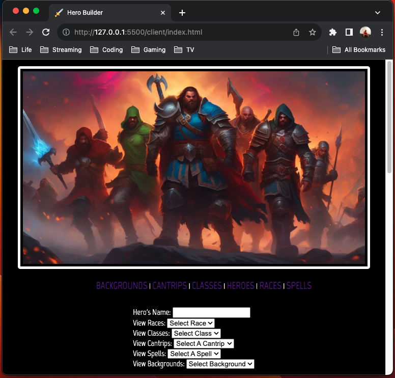
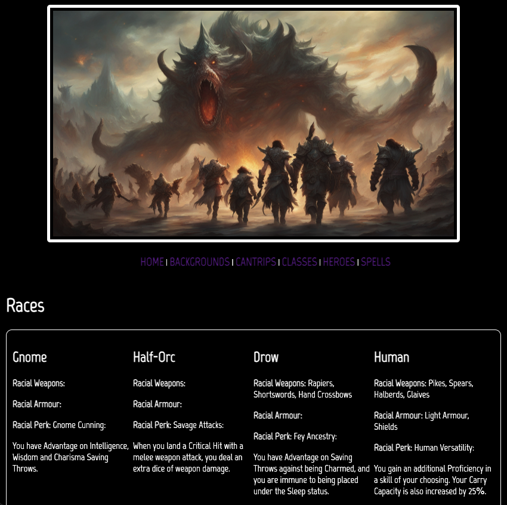
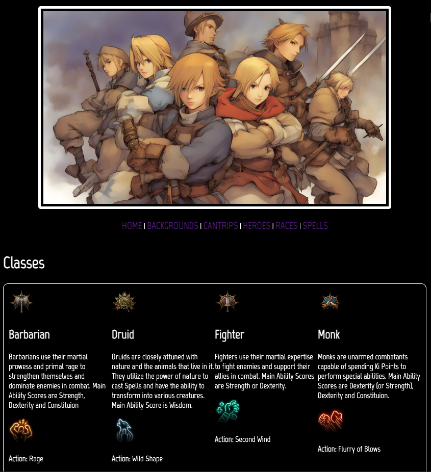
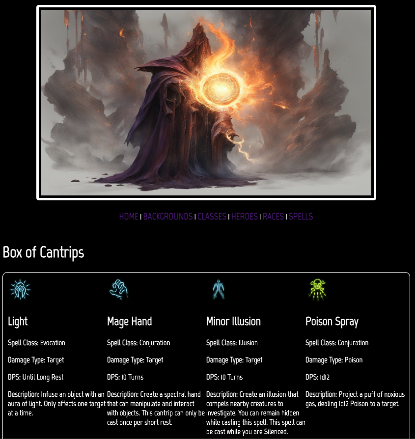
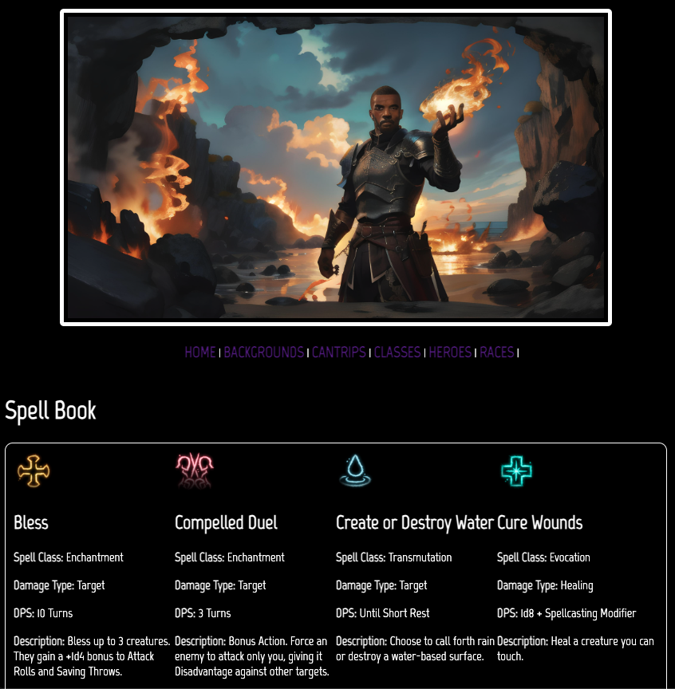
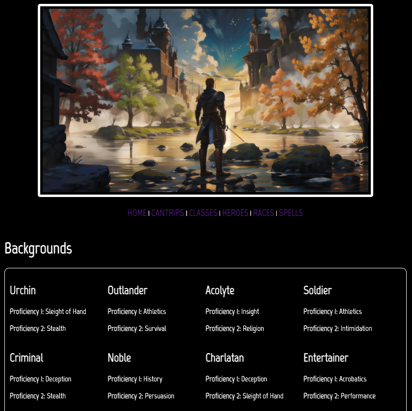

# MCBuild
Main Character Builder

## Description
A Full-Stack Project design to test my skills. An extensive database seeded with over 100 objects to be used by a user to build the perfect Main Character (MC). Full CRUD across the Back End, and the ability for the user to create and save a Main Character to a Hero Database.

## Technologies
- HTML
- JavaScript
- Responsive CSS
- Node
- Express
- MongoDB

## MC Builder: Wire Frame

## MC Builder: ERD

https://drive.google.com/file/d/1mBqfFpQLnGT8OYghmGyni-Od6rzV7B4a/view?usp=sharing

## Contact
- LinkedIn: https://www.linkedin.com/in/kyndallocascio/
- Github: https://github.com/KLoCascio

## Construction of a Hero: Behind-the-Scenes

01. Name String: Type in your Main Character's Name.

02. Race: Select a Race for your Main Character from (8 Races):
- Human
- Elf
- Drow
- Half-Elf
- Half-Orc
- Halfling
- Dwarf
- Gnome

03. Class: Select a Class for your Main Character from (12 Classes):
- Barbarian
- Bard
- Cleric
- Druid
- Fighter
- Monk
- Paladin
- Ranger
- Rogue
- Sorcerer
- Warlock
- Wizard

04. Cantrips: Select a Cantrip for your Main Character from (23 Cantrips):
- Acid Splash
- Blade Ward
- Bone Chill
- Dancing Lights
- Eldritch Blast
- Entangle
- Fire Bolt
- Friends
- Guidance
- Light
- Mage Hand
- Minor Illusion
- Poison Spray
- Produce Flame
- Ray of Frost
- Resistance
- Sacred Flame
- Shillelagh
- Shocking Grasp
- Thaumaturgy
- Thorn Whip
- True Strike
- Vicious Mockery

05. Spells: Select a Spell for your Main Character from (52 Spells):
- Animal Friendship
- Armour of Agathys
- Arms of Hadar
- Bane
- Bless
- Burning Hands
- Charm Person
- Chromatic Orb
- Colour Spray
- Command
- Compelled Duel
- Create or Destroy Water
- Cure Wounds
- Disguise Self
- Dissonant Whispers
- Divine Favour
- Enhance Leap
- Ensnaring Strike
- Entangle
- Expeditious Retreat
- Faerie Fire
- False Life
- Feather Fall
- Find Familiar
- Fog Cloud
- Goodberry
- Grease
- Guiding Bolt
- Hail of Thorns 
- Healing Word
- Hellish Rebuke
- Heroism
- Hex
- Hunter's Mark
- Ice Knife
- Inflict Wounds
- Longstrider
- Mage Armour
- Magic Missile
- Protection from Evil and Good
- Ray of Sickness
- Sanctuary
- Searing Smite
- Shield
- Shield of Faith
- Sleep
- Speak with Animals
- Tasha's Hideous Laughter
- Thunderous Smite
- Thunderwave
- Witch Bolt
- Wrathful Smite

06. Background: Select a Background for your Main Character from (11 Backgrounds):
- Acolyte
- Charlatan
- Criminal
- Entertainer
- Folk Hero
- Guild Artisan
- Noble
- Outlander
- Sage
- Soldier
- Urchin